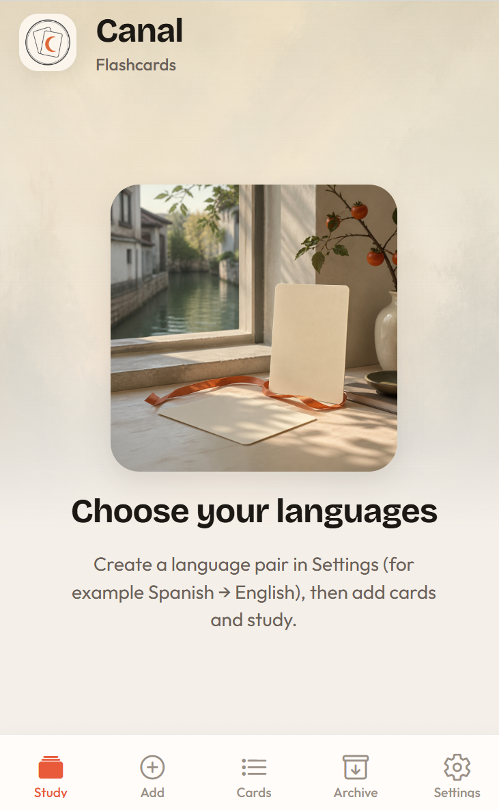
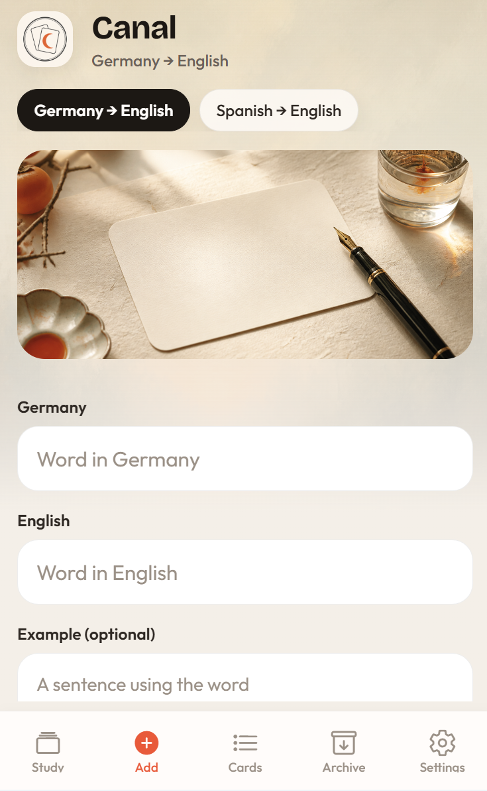
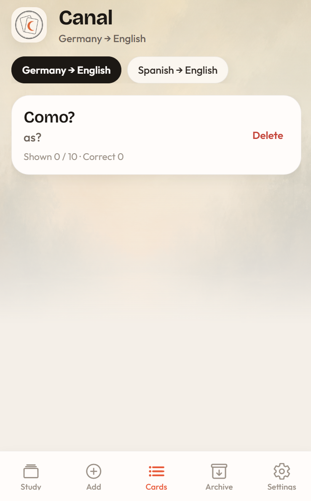
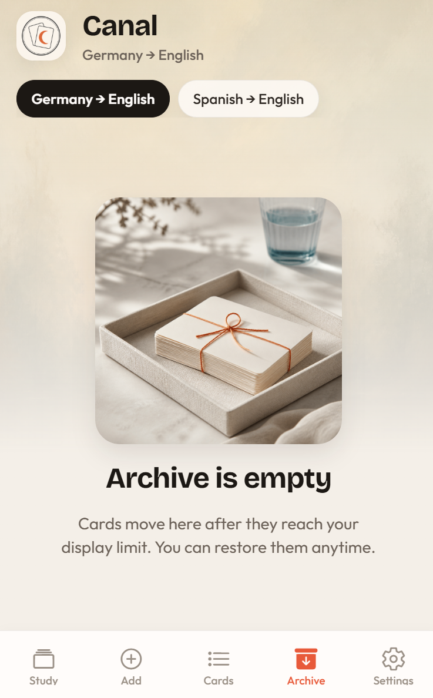
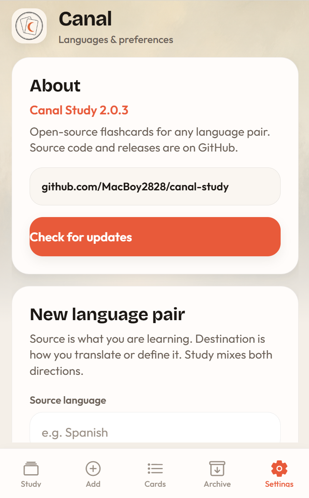

# Canal Study

Offline flashcards for learning any language pair — Spanish → English, Dutch → Persian, or whatever you need.

Everything stays on your phone. No account. No cloud.

## What you can do

- **Study** — flip cards, then swipe or tap Correct / Wrong  
- **Add** — quickly enter new words (keyboard stays open for the next one)  
- **Cards** — browse and edit your active deck  
- **Archive** — cards move here after enough practice; restore anytime  
- **Settings** — language pairs, display limit, daily reminder, updates  

Study mixes both directions (e.g. Spanish→English and English→Spanish). About **3 in 4** prompts are classic flashcards; about **1 in 4** are **multiple-choice** with four answers (when you have enough cards).

## Screenshots

Add your screenshots into `docs/screenshots/` and they will show here:

| Study | Add | Cards |
| --- | --- | --- |
|  |  |  |

| Archive | Settings |
| --- | --- |
|  |  |

## Install (Android)

1. Open the latest [Release](https://github.com/MacBoy2828/canal-study/releases/latest).
2. Download **Canal-Study.apk**.
3. Allow install from that source if Android asks.
4. Open the app and create a language pair in **Settings**.

In-app **Check for updates** (Settings) looks at GitHub Releases for a newer APK.

## Updating without losing your cards

Your language pairs, cards, archive, and settings live in a local database on the phone (`canal-study.db`).

**Installing a newer Canal Study APK over the existing app does not wipe that data**, as long as you:

- Install the update **on top of** the current app (do not uninstall first)
- Keep using the same app id (`com.canalstudy.app`) — all official Canal Study releases do

Uninstalling the app, clearing app storage in Android settings, or installing a differently signed “same-looking” APK as a fresh install **will** remove local data.

## Daily reminder

In **Settings → Daily reminder**, turn on the switch and pick a time.

On Android you may also need to allow **Alarms & reminders** (exact alarms) so the notification can fire even when the app is closed. Canal Study will try to open that system screen when you enable the reminder.

## Tips

- Switch language pairs with the chips at the top of Study / Add / Cards / Archive.
- **Display limit** is how many times a card is shown before it goes to the Archive. Raising the limit can bring some archived cards back; lowering can archive cards that already meet the new limit.
- Manual **Restore** in Archive resets that card’s counters.

## Privacy

Canal Study stores cards and settings only on your device (SQLite). Reminders are local notifications — nothing is uploaded for study data.

## For developers

```bash
npm install
npx expo start
```

Android release APKs are built with GitHub Actions: **Actions → Release Android APK**. Optional **notes** become the GitHub Release text; commits between tags are added automatically.

See the workflow in `.github/workflows/release-apk.yml`.

## License

MIT — see [LICENSE](LICENSE).
